# How to set up Duofarmer Server and cron-job for 100% automation farming

## Why you need to setup yourself?
I dont have any vps or paid server, so if i give you my server link it will get "rate limit" just with 2 account. That why you need to setup urself, but it only take a bit time, after this, it will be 100% automation

## Folk DuofarmerServer Repository
1. First, you need a Github account
2. Folk (and star pls 🥺) this repo [DuofarmerServer](https://github.com/lamduck2005/DuofarmerServer)
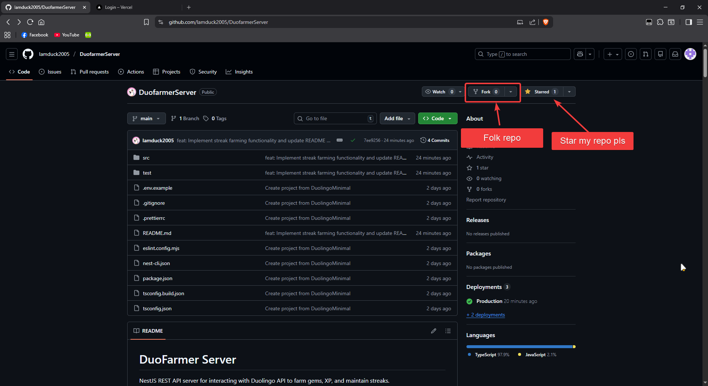
3. Now you have a folked repo name DuofarmerServer in your Github repository

## Deploy DuofarmerServer to Vercel ( or any platform if you want, i suggest vercel cuz it free )
1. Go to [Vercel login](https://vercel.com/login) and login (create) using Github account (recommend)
2. Fill the form it require and wait for response (idk why they need it, but after have success email then u can continue )
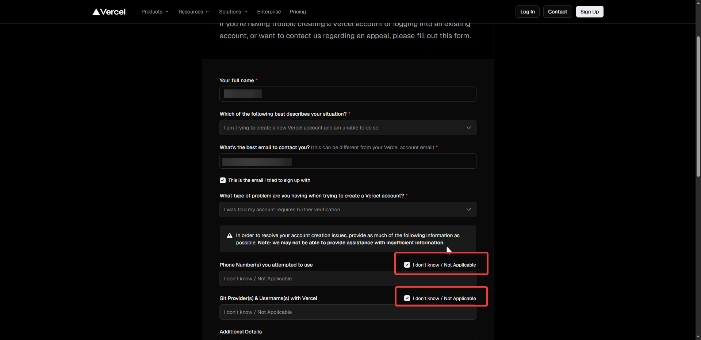

3. From Vercel dashboard, create new project
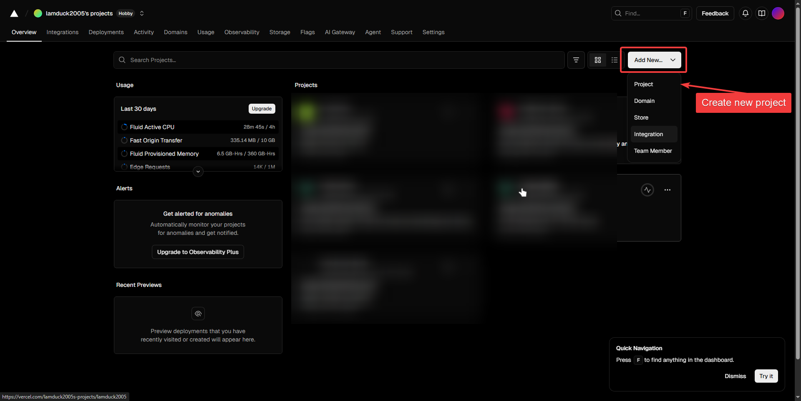
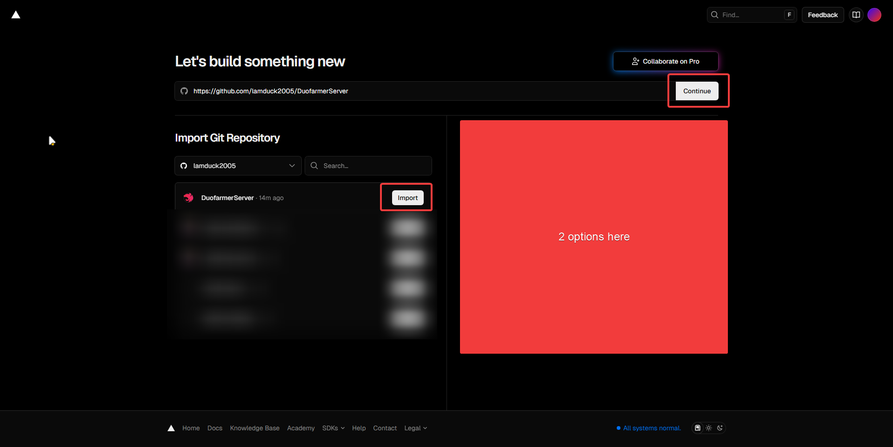
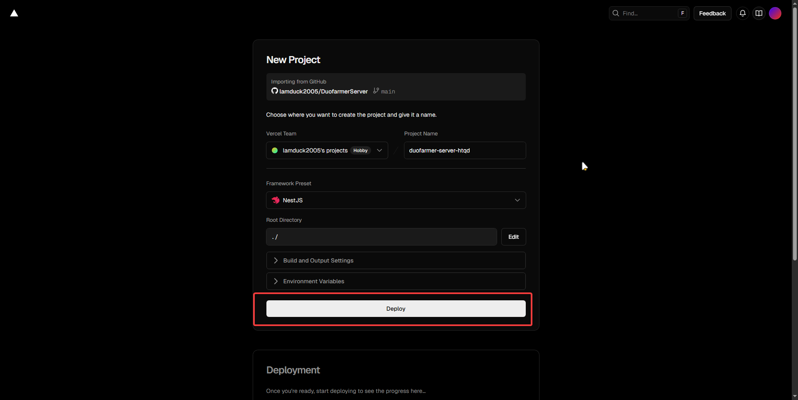
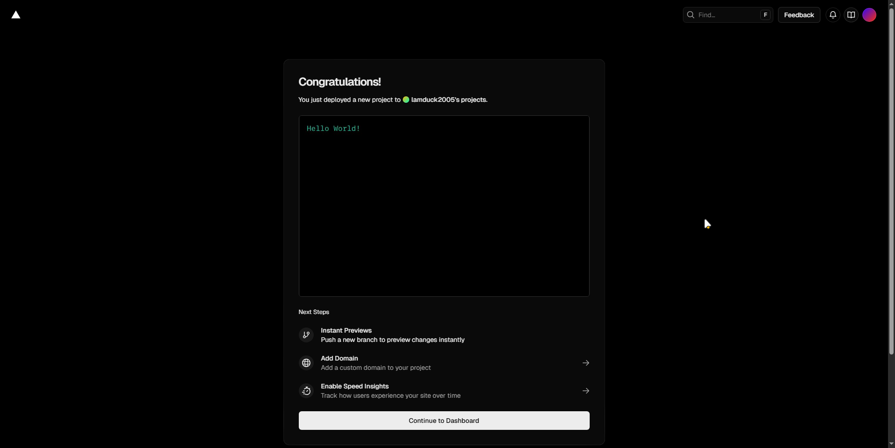

4. After deploy, copy your link and keep it private
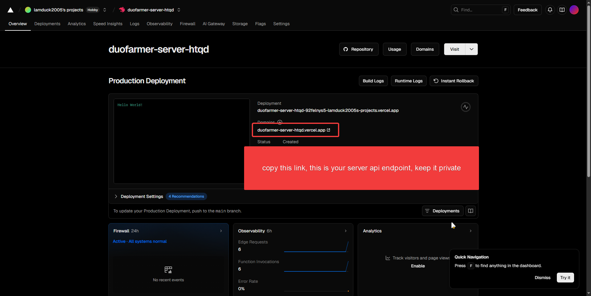

## That 90% done, now move to cron-job.org
1. Create an account on [cron-job.org](https://cron-job.org)
2. From dashboard, create a new cron-job
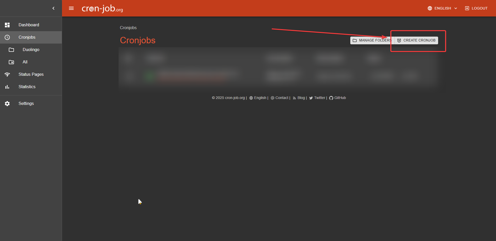

3. In `Common` tab, set:
   - URL: your deployed endpoint (examples below)
   - Execution: choose your schedule (e.g., every 30 minutes)
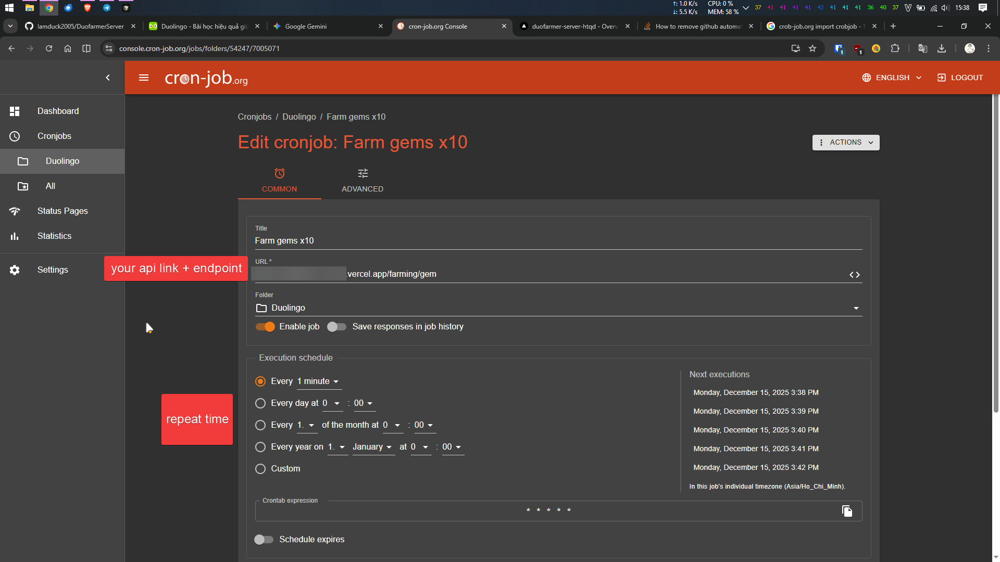

4. In `Advanced` tab:
   - Request method: `POST`
   - Add header: `Content-Type: application/json`
   - Request body by endpoint (times/amount support clarified):
     - `/farming/gem` (supports `times` 1–10, no `amount`)
       - Single: `{"jwt":"<YOUR_JWT>"}`
       - Batch: `{"jwt":"<YOUR_JWT>","times":5}` (max 10)
     - `/farming/xp/session` (supports `times` 1–10, requires `amount`)
       - Valid amounts: 10, 20, 40, 50, 110
       - Example: `{"jwt":"<YOUR_JWT>","amount":10,"times":1}`
     - `/farming/xp/story` (supports `times` 1–10, requires `amount`)
       - Valid amounts: 50, 100, 200, 300, 400, 499
       - Example: `{"jwt":"<YOUR_JWT>","amount":50,"times":1}`
     - `/farming/streak/farm` (no `times`, no `amount`): `{"jwt":"<YOUR_JWT>"}`
     - `/farming/streak/maintain` (no `times`, no `amount`): `{"jwt":"<YOUR_JWT>"}`
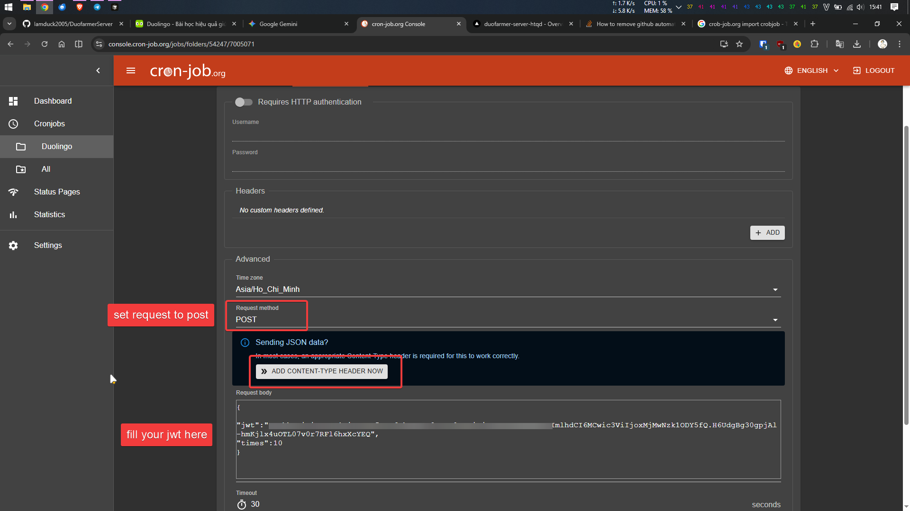

5. Test run to check success, then save for auto
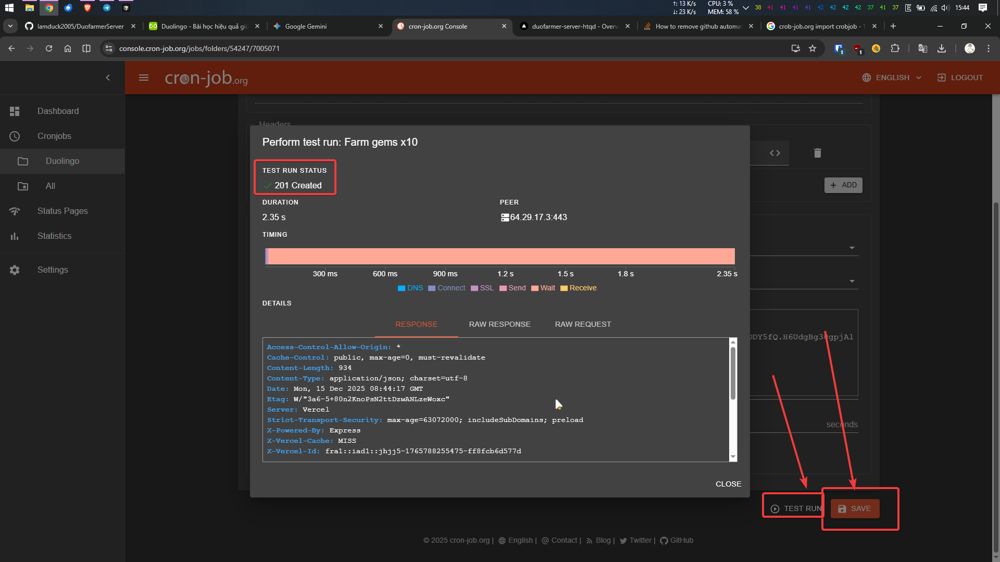

6. Clone this cron-job and change only the URL/body for other farm types (gem, xp session/story, streak farm/maintain)
